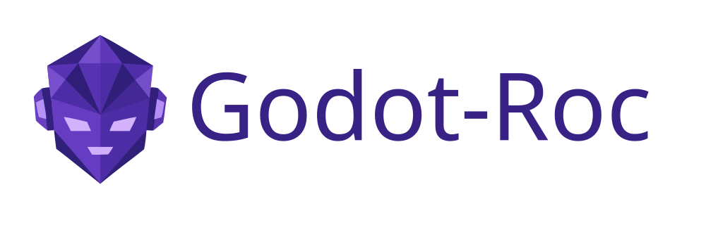
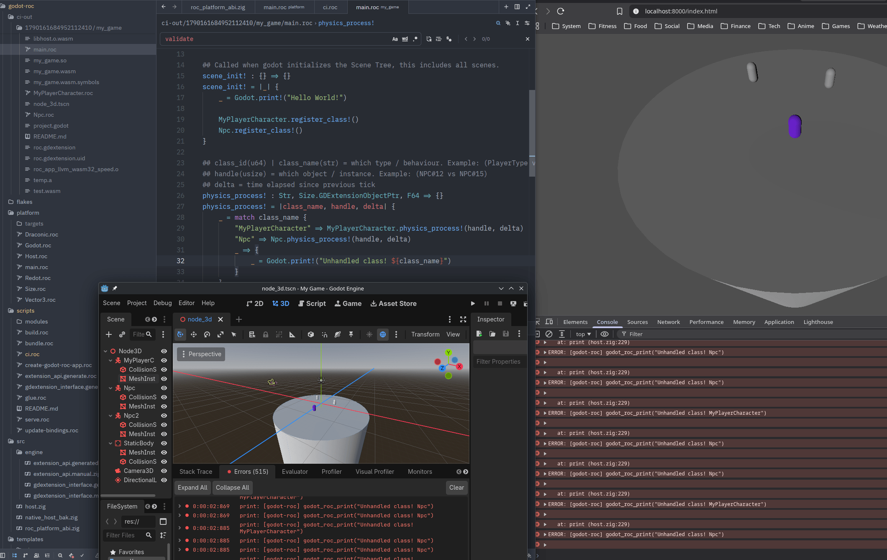

# 

Roc language bindings for Godot Game Engine, Redot Game Engine & Draconic Game Engine.

> [!IMPORTANT]   
> This project is under development, and there are missing or incomplete features.

> [!NOTE]   
> This page is for the godot-roc **platform**.
>
> For godot-roc **game development** see our [Getting Started Guide](templates/godot/README.md).

## About

Godot-Roc lets you write game logic in [Roc](https://roc-lang.org/), "A [fast](https://roc-lang.org/fast), [friendly](https://roc-lang.org/friendly), [functional](https://roc-lang.org/functional) [language](https://roc-lang.org/)". While [Godot Engine](https://godotengine.org/), [Redot Engine](https://www.redotengine.org/) or [Draconic Engine](https://github.com/Redot-Engine/DraconicEngine) handles scenes, rendering, and tooling.

Godot-Roc builds and tests against `godot-4.5.1` as the flagship runtime & ABI for maximum compatability. In theory godot-roc will work with any game engine runtime that supports the `godot-4.5.1` gdextension ABI, including newer versions of godot, forks & alternative host runtimes (aka game engines).

## Binding comparison

| | godot-roc | GDScript | C# | C++ |
| --- | --- | --- | --- | --- |
| **API coverage** | \[WIP] What the binding exposes [[exposed-api](platform/)] \[TODO-docs] [[DONE-engine-to-zig-binding-generator](scripts/gdextension_interface.generate.roc)] \[TODO-engine-to-roc-binding-generator] \[TODO-glue-to-glue-generator] | Full engine scripting API | Broad official bindings | Full native access |
| **Native desktop support** | Linux (\[WIP] cross-compiling; windows & macos) | Linux, windows & mac | Linux, windows & mac | Linux, windows & mac |
| **Web support** | GDExtension wasm32-emscripten [[godot-demo](https://scottc.github.io/godot-roc)] [[redot-demo](https://scottc.github.io/redot-roc)] | First-class, full | Not supported (official) | GDExtension wasm (emscripten) |
| **Role in Godot** | Community binding (this project) | First-party script language | Official .NET support | Engine / GDExtension native |

## Language & Compiler comparison

| | Roc | GDScript | C# | C++ |
| --- | --- | --- | --- | --- |
| **Iteration speed in Godot** | Fast native rebuild & reload pipeline. 1 class ~=250/300ms(cache/no-cache) on my potato laptop | Very fast | Fast | Slow–moderate (compile native) |
| **Learning curve** | [Easy-moderate](https://roc-lang.org/friendly) (if new to FP) | Easy | Moderate | Hard |
| **Performance potential** | [High](https://roc-lang.org/fast) (native extension path) | Good enough for most games | High | Highest (engine-level) |
| **Skills transfer outside Godot** | Yes (general Roc / FP) | Limited | Yes | Yes |
| **Primary style** | ✨[**Functional**](https://roc-lang.org/functional)✨ | Multi-paradigm, script-oriented | Multi-paradigm | Multi-paradigm |
| **Type system** | ✨**Strong, static, inference**✨ | Optional / gradual | Static (nullable & pragmatism) | Static (manual discipline) |
| **Ecosystem maturity** | New [[projects](https://github.com/lukewilliamboswell/roc-awesome)] | Mature (Godot-focused) | Mature | Mature |
| **Docs & tutorials** | Offical Language docs [[roc-docs](https://roc-lang.org/docs/main/)] [[roc-examples](https://roc-lang.org/examples/)] & emerging community | Official & plentiful | Official + .NET ecosystem | Official engine docs; steeper |

*This table is intentionally simplified. Real projects can mix languages (e.g. GDScript for UI + Roc or C# for gameplay + C++ for hotspots).*

[Other community maintained languages](https://docs.godotengine.org/en/stable/tutorials/scripting/other_languages.html#doc-scripting-languages), and [engines](https://docs.redotengine.org/tutorials/scripting/gdextension/what_is_gdextension#doc-what-is-gdextension) are also avaliable.

## Performance Profile

| | Roc (godot-roc) | GDScript | C# | C++ / GDExtension |
|--|-----------------|----------|-----|-------------------|
| **Execution model** | [Native](https://roc-lang.org/fast) (Roc → machine code; [Zig](https://ziglang.org/) host in a GDExtension) | Bytecode on Godot’s VM | .NET (JIT/AOT depending on setup) | Native |
| **Pure number crunching** | High (native) | Slowest of these | Usually much faster than GDScript | Fastest / engine-level |
| **Calling into Godot APIs** | Native extension path (ptrcall / binds); not free if very chatty | Very direct (language designed for this) | Can pay marshalling costs | Direct native |
| **Small, API-heavy glue** | Fine; bound by engine + bind overhead | Often “fast enough”; very low friction to engine | Marshalling can dominate tiny calls | Fast, but awkward for large amounts of glue |
| **Heavy algorithms in script/app code** | Strong fit | Prefer not to keep in pure GDScript | Strong option | Best option |
| **Typical game bottleneck** | Often still rendering / physics / draw calls (engine C++), not Roc vs GDScript | Same | Same | Same unless you replace engine systems |

GDScript runs on a bytecode VM and is not compiled to native machine code for
gameplay scripts. In Godot 4, typed GDScript is faster than untyped, but tight
pure-script loops still lag C#/C++. Roc in godot-roc is compiled to native code
and the host is Zig (also native) loaded as a GDExtension—there is no Roc VM in
the game loop. For all of these, much gameplay work is ultimately engine C++
(physics, rendering), so language choice often does not dominate frame time
until profiling shows a script/app-side hotspot.

## Use Cases

- **DX - Developer Experience** - Ergonomics of a high level scripting language, with great low level native performance.

- **Structured game logic** - Model complex rules with types that encode invariants, so invalid states are harder to represent.

- **Fewer playtest bugs** - A strong static type system catches many mistakes at compile time. Good types won’t eliminate playtesting, but they can eliminate many failures.

- **AI-friendly tooling and errors** - More stronger types = more precise compile time errors, that are easier to act on for (humans or automated loops) than vague runtime failures.

## Who is this for?

**Good fit:** experimenters, hobbyists, and people who want to explore Roc for game logic or help shape an early binding.

**Possible but demanding:** beginners and production teams - expect fewer tutorials, a smaller community, and sharper edges than GDScript or C#.

**Not yet:** “drop-in replacement for GDScript to ship a commercial title with zero friction.” If you need that reliability *today*, use Godot’s first-party stack and keep an eye on this project as it matures.

**Right place if:** you like bleeding-edge tooling, are comfortable building against an evolving platform, and care more about typed functional logic than maximum Godot-native convenience.

## When you should strongly consider using godot-roc

You want the ergonomics of a high level scripting language, and 90% of the performance ceiling of a compile to native language. And are whilling to deal with the sharp edges & bugs that comes with latest bleeding edge technology.

## Supporting godot-roc

godot-roc is developed & maintained by a solo dev; me. Here are some things that would greatly help me.

- **Game Dev Testers**, dog fooding small prototypes is one thing. But, I need some game devs, to actually use this project and give me experience reports. Ideally in a complete end-to-end ship game to production environment. What are the blockers? Where are the sharp edges? What could be smoother, faster & more seemless? This can help me prioritize and discover & resolve problems faster.

- **A LLM subscription, or hardware**, unfortunately I don't have access to one... and can't justify one, yet. It could help speed up my progress. Free LLM services, have useage caps; 20 prompts a day or 50k tokens etc. And are only suitable for casual prompting.

- **A source of income**, to pay my bills & rent. At the moment, I'm in the red at the end of every month and this is not sustainable long term. And ideally make a modest living & support my other hobbies; compute/embeded hardware, gadgets etc. If you can afford it, consider donating (when I setup patreon & sponsorships), or give me a job offer for sustainable long-term on-going work.

- **Freedom to continue working on godot-roc**, as how I see fit... For me, I just generally enjoy the process of experimenting with new technology, dealing with new & difficult challenges. And ultimately to serve the needs & desires of game developers & gamers. And I hope that you find this project to be extremely useful.

- **Freedom to move onto the next project**, while this project is great. I eventually see the need to swap out the engine, to a more modern, open-source, high performance design that can out-compete unreal & unity. And the godot-4.5.1 style bindings could be a limiting factor in engine design. As such I have my eyes on the next generation ECS-like engines; bevy and alike. And this would warrent a new project from scratch, it doesn't make sense to add engines beyond the godot family to this project.
